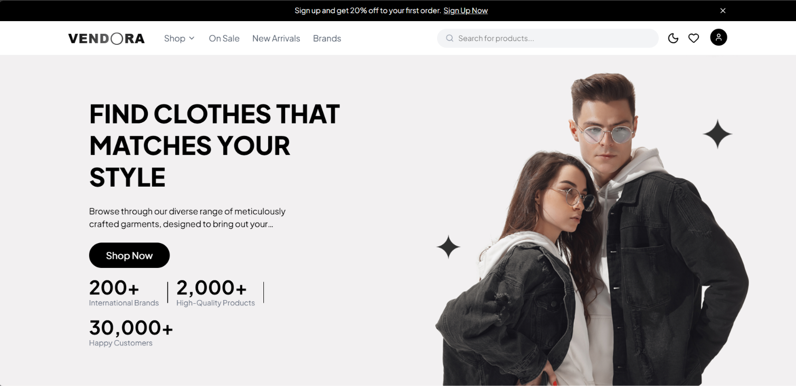
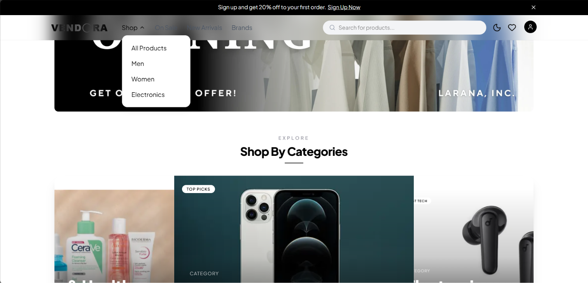
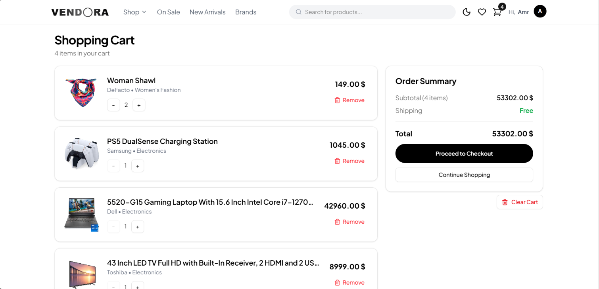
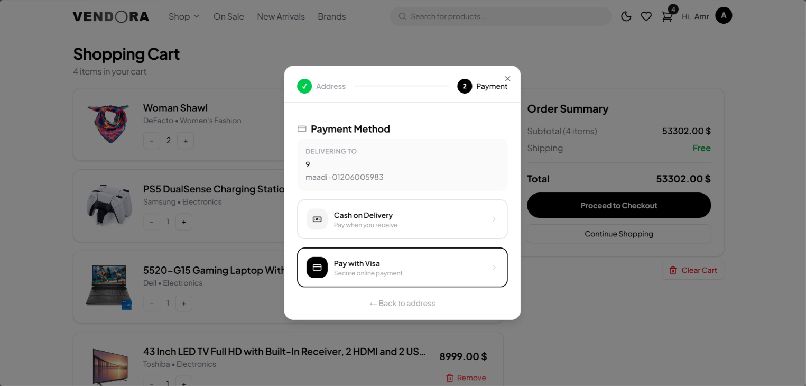

<p align="center">
  
</p>

<h1 align="center">Vendora</h1>

<p align="center">
A modern e-commerce platform built with <strong>Next.js 15</strong>, delivering a fast, secure, and intuitive shopping experience.
</p>

<p align="center">
  <a href="https://vendora-store.vercel.app/">Live Demo</a>
  •
  <a href="#preview">Preview</a>
  •
  <a href="#features">Features</a>
  •
  <a href="#tech-stack">Tech Stack</a>
  •
  <a href="#getting-started">Getting Started</a>
</p>

<p align="center">
  
  
  
  
  
</p>

---

## Overview

Vendora is a modern full-stack e-commerce application built with production-ready technologies and best practices.

The project focuses on creating a scalable, secure, and high-performance shopping experience while maintaining clean architecture and reusable components. It includes authentication, wishlist management, shopping cart, secure checkout, order tracking, responsive design, and smooth user interactions.

Rather than being just a UI showcase, Vendora demonstrates how a real-world e-commerce application can be structured using the latest Next.js ecosystem.

---

## Live Demo

**https://vendora-store.vercel.app/**

---

## Preview

<table>
<tr>
<td width="50%">

### Home



</td>

<td width="50%">

### Products



</td>
</tr>

<tr>
<td width="50%">

### Cart



</td>

<td width="50%">

### Checkout



</td>
</tr>
</table>

---

## Features

### Shopping Experience

- Browse products
- Instant product search
- Category filtering
- Product details page
- Responsive product gallery

### User Account

- Secure authentication
- Wishlist management
- Shopping cart
- Order history
- User profile

### Checkout

- Visa payment
- Cash on Delivery
- Order confirmation

### User Experience

- Fully responsive design
- Dark mode
- Skeleton loading
- Smooth page animations
- Toast notifications
- Optimized image loading

---

## Tech Stack

| Category | Technology |
|----------|------------|
| Framework | Next.js 15 (App Router) |
| Language | TypeScript |
| Styling | Tailwind CSS |
| UI Components | shadcn/ui |
| Animations | Framer Motion |
| Authentication | NextAuth.js |
| State Management | Context API |
| Email Service | Resend |
| Icons | Lucide React |

---

## Project Structure

The project is organized using the Next.js App Router with a modular architecture that separates pages, reusable components, shared utilities, and application logic.

```text
src/
├── app/                         # Application routes (Next.js App Router)
│   ├── (pages)/                 # Main application pages
│   │   ├── addresses/
│   │   ├── allorders/
│   │   ├── brands/
│   │   ├── cart/
│   │   ├── categories/
│   │   ├── contact/
│   │   ├── login/
│   │   ├── products/
│   │   │   ├── [...productId]/
│   │   │   └── _action/
│   │   ├── profile/
│   │   ├── register/
│   │   └── wishlist/
│   │
│   └── api/                     # API route handlers
│       ├── auth/
│       ├── contact/
│       ├── get-cart/
│       ├── newsletter/
│       └── users/
│
├── components/                  # Reusable UI components
│   ├── address/
│   ├── addToCart/
│   ├── checkOut/
│   ├── context/
│   ├── footer/
│   ├── home/
│   ├── layout/
│   ├── navbar/
│   ├── product-card/
│   ├── productSlider/
│   ├── search/
│   ├── transition/
│   ├── ui/
│   └── wishlist/
│
├── data/                        # Static application data
├── hooks/                       # Custom React hooks
├── interfaces/                  # TypeScript interfaces
├── lib/                         # Shared utility functions
├── Helpers/                     # Helper functions
├── types/                       # Global type definitions
│
├── auth.ts                      # NextAuth configuration
└── proxy.ts                     # Request proxy configuration
```

---

## Architecture

The application follows a modular architecture to improve scalability and maintainability.

- Component-based architecture
- Reusable UI components
- Context API for global state
- Server Actions for secure requests
- Route protection using middleware
- Environment variables for sensitive data
- Clear separation between UI and business logic

---

## Performance

The application is optimized using modern Next.js features.

- App Router
- Server Components
- Code Splitting
- Lazy Loading
- Image Optimization
- Fast Navigation
- Skeleton Screens

---

## Security

Security is implemented using modern best practices.

- Secure authentication with NextAuth.js
- Protected routes
- Server-side actions
- Environment variables
- No sensitive credentials exposed to the client

---

## Getting Started

Clone the repository

```bash
git clone https://github.com/Amr-Suliman/vendora.git
```

Navigate to the project

```bash
cd vendora
```

Install dependencies

```bash
npm install
```

Create your environment file

```bash
cp .env.example .env.local
```

Run the development server

```bash
npm run dev
```

Open your browser

```text
http://localhost:3000
```

---

## Environment Variables

Create a `.env.local` file and add the following variables:

```env
NEXTAUTH_URL=

NEXTAUTH_SECRET=

RESEND_API_KEY=

API_BASE_URL=
```

---

## Roadmap

- Product Reviews
- Product Ratings
- Coupons & Discounts
- Admin Dashboard
- Product Recommendations
- Multi-language Support
- Inventory Management
- Stripe Integration

---
